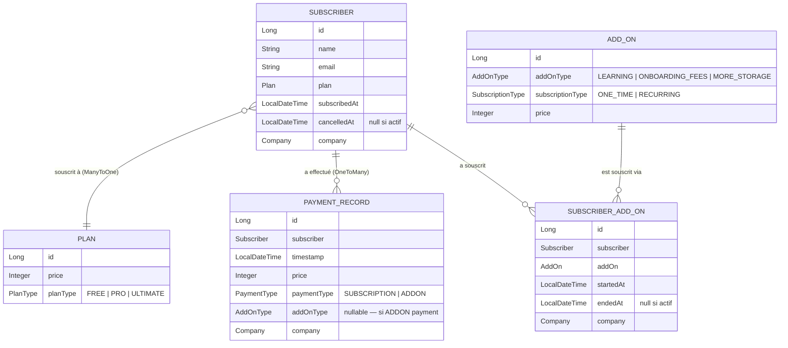
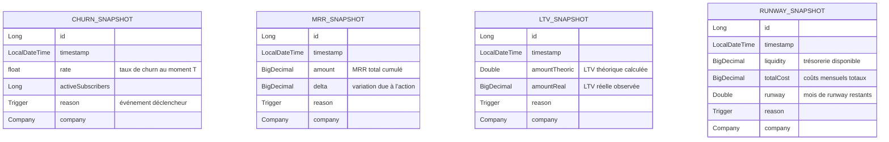

## Schéma 1 — Cœur métier

> Relations entre les abonnés, leurs plans et leurs add-ons.



## Schéma 3 — Snapshots analytiques

> Tables autonomes de métriques, sans FK vers les entités métier.  
> Chaque snapshot est déclenché par un `Trigger` (événement système).



## Énumérations

### `PlanType`
```
FREE | PRO | ULTIMATE
```

### `AddOnType`
```
LEARNING | ONBOARDING_FEES | MORE_STORAGE
```

### `PaymentType`
```
SUBSCRIPTION | ADDON
```

### `SubscriptionType`
```
ONE_TIME | RECURRING
```